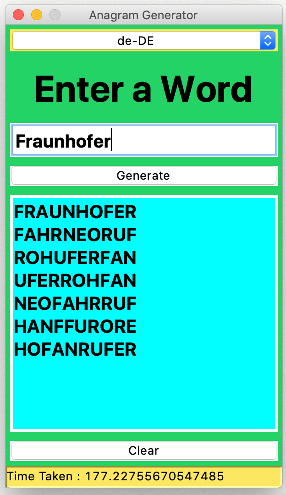

# Anagram-Generator

Returns a list of words from a given word with exactly the same alphabets but in different arrangements still making some sense. This is a simple application that uses permutation to compute all the possible arrangements of the word and checks the resulting list against the available English dictionary. Only the valid English words are returned as the output.

---

<h5>Screenshots</h5>
<table>
<tr>
<td>

</td>
</tr>
</table>
---
