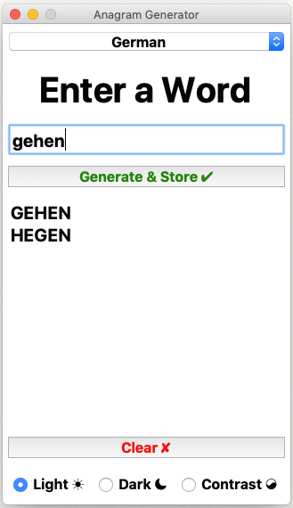

# Polyglot Anagram Generator

Returns a list of words from a given word with exactly the same alphabets but in different arrangements with some meaning. This is a simple application that uses permutation to compute all the possible arrangements of the word and checks the resulting list against the available dictionaries. Only the meaningful words are returned as the output.

---
<table>
  <th>Language</th>
  <th>Code</th>
  <tr>
    <td>German</td>
    <td>de-DE</td>
  </tr>
  <tr>
    <td>French</td>
    <td>fr-FR</td>
  </tr>
  <tr>
    <td>British English</td>
    <td>en-GB</td>
  </tr>
  <tr>
    <td>American English</td>
    <td>en-US</td>
  </tr>
  <tr>
    <td>Australian English</td>
    <td>en-AU</td>
  </tr>
  </table>

<h5>Screenshots</h5>

  <table>
<tr>
<td>

</td>
</tr>
</table>

---

<h5>Required Packages<h5>
<table>
  <th>Name</th>
  <th>Version</th>
  <tr>
    <td>pyenchant</td>
    <td>2.0.0</td>
  </tr>
  <tr>
    <td>googletrans</td>
    <td>  2.4.0
</td>
  </tr>
  </table>

